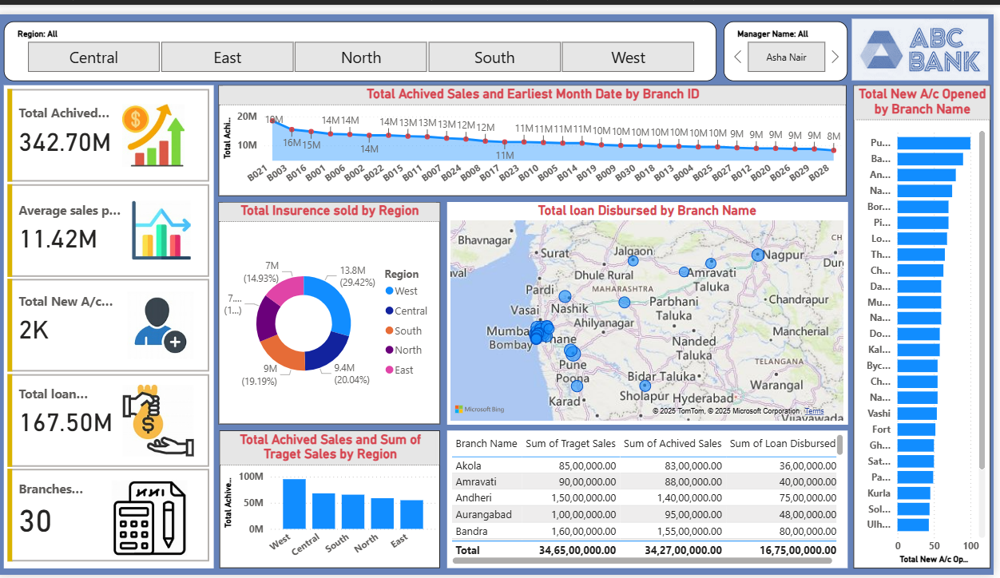

# ABC Bank - Sales and Loan Performance Dashboard 📊

This Power BI project visualizes key performance metrics for a fictional bank across various regions and branches.

## 📌 Project Overview

This dashboard was built to analyze:
- Total achieved sales
- Loan disbursed by branches
- Insurance sold by region
- New account openings
- Average sales per branch
- Sales target vs achieved

## Key Features

- **Dynamic filters** for Region and Manager
- **Map visualization** to show branch-level loan disbursement
- **Pie & Bar Charts** for insurance and sales comparisons
- **KPI Cards** for high-level metrics like total sales, accounts, and branches

## 🛠 Tools Used

- Power BI
- DAX
- Excel (for initial data cleaning)

 ## 📸 Screenshot

## 📁 Files

- 
- [File of Dashboard](ales Performance Dashboard.pbix).

## 💡 Insights (example)

- The West region achieved the highest total sales.
- Branches in Mumbai showed high loan disbursement.
- New account openings were highest in Pune and Bandra.
